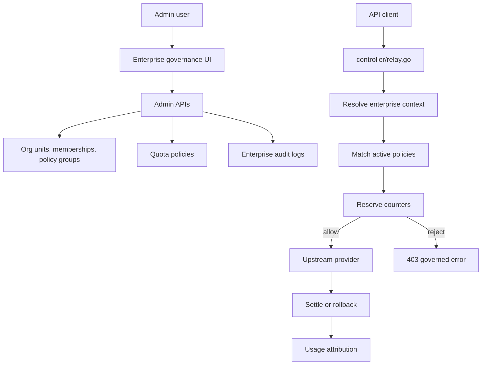

# Enterprise Organization And Quota MVP Delivery Plan

本文档是企业组织与额度治理 MVP 的交付总入口。它把整体方案、任务拆分、工程蓝图和
发布手册收敛成一份可执行计划，便于后续直接进入实现。

配套文档：

- `docs/enterprise-org-quota-plan.md`：整体产品和架构方案。
- `docs/enterprise-org-quota-cel-policy-engine-plan.md`：CEL 条件层和策略引擎开发目标。
- `docs/enterprise-org-quota-task-plan.md`：完整 Backlog、阶段和 PR 切分。
- `docs/enterprise-org-quota-implementation-blueprint.md`：后端模型、接口、算法和接入点。
- `docs/enterprise-org-quota-rollout-runbook.md`：发布、灰度、观测和回滚流程。
- `docs/enterprise-governance-admin-guide.md`：管理员首条策略配置和拒绝排查指南。

## MVP 一句话

在不重写现有用户额度、令牌额度、计费和渠道路由的前提下，为 Data Proxy 增加一层
默认关闭的企业治理能力，让管理员可以按部门、策略分组和用户配置每日/月请求次数与
系统 quota 上限，并在 relay 请求前拦截超额调用、请求后归集用量。

## 首版范围

必须交付：

- 单企业治理底座，默认企业自动初始化，表结构保留 `enterprise_id`。
- 部门树：创建、编辑、移动、停用、成员列表。
- 成员归属：用户绑定一个主部门。
- 策略分组：跨部门用户集合，支持成员维护。
- 额度策略：目标支持企业、部门、策略分组、用户。
- 强限制指标：`request_count`、系统 `quota`。
- 归集指标：request count、quota、prompt tokens、completion tokens、total tokens。
- 周期：每日、每月。
- 模型范围：全部模型、指定模型列表。
- 超额动作：拒绝。
- relay 接入：请求前检查和预占，请求后结算和归集。
- dry-run：记录本应拒绝的决策，不影响真实请求。
- 管理端：组织架构、策略分组、额度策略、用量报表、审计日志。
- 发布能力：默认关闭、dry-run 灰度、硬限制灰度、关闭开关回滚。

明确不做：

- 多企业后台和租户切换。
- 项目/成本中心。
- 审批流和临时额度申请。
- 自动降级模型。
- SSO/LDAP/飞书/企业微信组织同步。
- Redis 原子计数作为首版必需路径。
- token 级硬限制。
- 普通管理员可编辑的任意表达式策略。
- 多级管理员权限的完整 RBAC。
- 组织级发票、内部结算单或成本分摊账单。

## 已确认口径

这些口径作为 MVP 默认决策执行，除非后续产品讨论明确推翻。

| 编号 | 决策 | MVP 行为 |
| --- | --- | --- |
| D1 | 单企业先行 | 默认企业 `default`，所有表保留 `enterprise_id` |
| D2 | 默认关闭 | enabled=false 时 relay 行为零变化 |
| D3 | 先 dry-run | 硬限制前必须能观测 would reject |
| D4 | 强限制指标 | 只拦截 `request_count` 和 `quota` |
| D5 | token 口径 | token 只做 attribution 和报表，不作为首版硬限制 |
| D6 | Root 用户 | 默认不豁免，必要时后续加独立开关 |
| D7 | Playground | 纳入企业治理 |
| D8 | API Key | 继承所属用户的企业、部门和策略分组 |
| D9 | 管理 API | 不受企业额度限制，只使用现有 AdminAuth/RootAuth |
| D10 | 错误语义 | 超额或模型不允许返回 403 和企业治理错误码 |
| D11 | 计数实现 | 首版用数据库事务/行锁，Redis 后置 |
| D12 | 策略关系 | 命中的硬限制全部生效，任一超额则拒绝 |

## 核心用户流程

### 管理员配置流程

1. 进入企业治理模块。
2. 确认默认企业信息。
3. 创建部门树，例如公司、研发部、市场部、运营部。
4. 把用户移动到主部门。
5. 创建策略分组，例如高阶模型试点、实习生、外包人员。
6. 给部门、策略分组或用户配置每日/月请求次数或 quota 策略。
7. 先开启 dry-run，观察 would reject 和用量报表。
8. 小范围关闭 dry-run，验证硬限制。
9. 全量启用正式策略。

### 用户调用流程

1. 用户或 API Key 发起 relay 请求。
2. 系统解析用户企业、主部门、部门祖先和策略分组。
3. 系统加载企业、部门、分组、用户命中的启用策略。
4. 系统检查模型范围。
5. 系统按预估 request count 和 quota 预占计数器。
6. 超额时回滚预占并返回 403。
7. 允许时继续走现有 relay 和 billing session。
8. 请求完成后按实际结果结算企业 counter。
9. 写入 usage attribution，供报表和排障查询。

## MVP 交付架构

实现边界：

- `model/` 保存数据结构、迁移、默认企业和审计基础。
- `service/` 保存上下文解析、策略匹配、预占、结算、dry-run 决策。
- `controller/enterprise*.go` 保存管理 API。
- `controller/relay.go` 统一接入企业治理，不进入具体 `relay/` channel adaptor。
- `web/default/src/features/enterprise/` 保存管理端 UI。

## 里程碑

### M0: 规划冻结

目标：把 MVP 范围、非目标、默认决策、任务、上线方式冻结。

交付物：

- `enterprise-org-quota-plan.md`
- `enterprise-org-quota-mvp-delivery-plan.md`
- `enterprise-org-quota-task-plan.md`
- `enterprise-org-quota-implementation-blueprint.md`
- `enterprise-org-quota-rollout-runbook.md`

验收：

- 文档说明整体方案、MVP、任务、工程和发布。
- 所有文档口径一致。
- `git diff --check -- docs/enterprise-org-quota-*.md` 通过。

### M1: 数据底座和开关

对应 PR：PR 1。

目标：加表、加默认企业、加开关和审计基础，不影响现有请求。

任务：

- 新增系统开关：enabled、dry-run。
- 新增企业治理模型和迁移。
- 初始化默认企业。
- 新增审计日志写入 helper。
- 增加基础测试。

验收：

- enabled=false、dry-run=false 默认关闭。
- 新库和老库启动都有默认企业。
- 关闭开关时 relay 不读取企业治理数据。
- `go test ./model ./common` 通过。

### M2: 管理 API

对应 PR：PR 2。

目标：管理员可以通过 API 管理组织、成员、策略分组、额度策略和审计查询。

任务：

- 企业和部门 API。
- 成员主部门 API。
- 策略分组和成员 API。
- 额度策略 API。
- 审计日志查询 API。

验收：

- 所有写接口记录审计。
- 所有管理 API 挂 `AdminAuth`，系统开关仍走 `RootAuth`。
- 已用路由测试覆盖企业治理 API 的未登录、普通用户和管理员访问边界。
- 部门移动有环检测。
- 策略目标必须存在且属于同一企业。
- `go test ./model ./controller ./router` 通过。

### M3: 策略引擎

对应 PR：PR 3。

目标：service 层能独立完成上下文解析、结构化条件到 CEL 的编译/评估、策略匹配、
模型权限判断和额度预占。

任务：

- 引入 CEL 条件层，封装编译、校验、eval 和缓存。
- 为策略增加 `condition_mode`、`condition_json`、`condition_expr`、`condition_hash`。
- 定义 UI 结构化条件 schema，并生成稳定 CEL 表达式。
- 组织上下文解析。
- 策略候选加载和 CEL 条件过滤。
- 模型范围判断。
- 日/月周期计算。
- 计数器预占、回滚和 reservation。
- dry-run decision。

验收：

- 用户无部门时仍命中企业策略。
- 父部门策略对子部门用户生效。
- 用户多个策略分组时全部匹配。
- 结构化条件能生成稳定 CEL，表达式保存前可编译并返回 bool。
- 条件不匹配的策略不会进入 counter。
- 多策略任一超额则拒绝。
- dry-run 不拒绝但返回 would reject 信息。
- `go test ./model ./service` 通过。

### M4: Relay Dry-run 接入

对应 PR：PR 4。

目标：真实请求链路进入企业治理观测模式，但不默认硬拒绝。

任务：

- 在 `controller/relay.go` 价格预估后、现有 billing preconsume 前接入。
- enabled=false 时快速返回。
- dry-run=true 时记录 would reject。
- 成功请求写 attribution 雏形。
- 增加企业治理错误码基础。

验收：

- enabled=false 时 relay 回归零变化。
- dry-run=true 时超额请求仍成功。
- dry-run 记录包含 request ID 和 policy IDs。
- 不记录 prompt 明文。
- `go test ./controller ./service ./router` 通过。

当前进度：

- 已在 `controller/relay.go` 价格预估后、billing preconsume 前接入 `PreCheckEnterpriseGovernance`。
- 已实现 dry-run would reject 审计，审计内容只记录 request ID、策略 ID、模型、能力、channel、预估 quota 和组织上下文，不记录 prompt/API key。
- 已在 `PostTextConsumeQuota` 的 billing settle 成功后写入 `enterprise_usage_attributions` 雏形。
- 已补 `CheckEnterpriseQuota`，dry-run 只读检查不会创建或增加 counter。
- hard limit 的 reservation 生命周期已经进入 M5 后端核心；报表 API、并发回归和完整灰度验证继续放在 M5。

### M5: 硬限制和报表 API

对应 PR：PR 5。

目标：启用硬拒绝、完整结算、报表查询和并发回归。

任务：

- hard limit 模式返回 403。
- 超额请求不打上游。
- 成功请求按实际 quota 结算。
- 上游失败或 billing preconsume 失败时回滚企业 reservation。
- 用量 summary 和 breakdown API。
- 并发和周期边界测试。

验收：

- 超额请求稳定拒绝。
- 并发请求不会明显突破周期上限。
- 成功请求可按部门、分组、用户聚合。
- 关闭 enabled 可一键回退。
- `go test ./model ./controller ./service ./router` 通过。

当前进度：

- 已在 hard-limit 模式下调用 `EvaluateEnterprisePolicies` 并创建企业 quota reservation。
- 已在 relay 错误路径调用 `RefundEnterpriseGovernanceReservation`，覆盖 billing preconsume 失败后的企业 reservation 释放。
- 已在 `PostTextConsumeQuota` 用实际 request count、quota 和 token summary 调用 `SettleEnterpriseGovernanceUsage`。
- 已注册 `GET /api/enterprise/usage/summary` 和 `GET /api/enterprise/usage/breakdown`，支持时间范围、部门、策略分组、用户、模型和状态筛选。
- 已为 hard-limit 拒绝增加企业治理错误码，并按策略目标区分企业、部门、策略分组和用户额度超限。
- 已补企业治理拒绝的中文、英文和繁体中文 i18n 文案，用户响应不暴露内部 policy ID，管理员日志和审计仍保留策略诊断信息。
- 已补模型白名单交集判断，模型不允许返回专用错误码且不进入额度预占。
- 已补后端并发边界单测，验证并发 reservation 不突破策略 limit。
- 已补 `scripts/enterprise-governance-preflight.sh`，可一键执行发布前核验、定向测试和前端 typecheck/build。
- 待完成：预发/生产级灰度回滚演练。

### M6: 管理端 UI

对应 PR：PR 6。

目标：管理员可以在前端完成首版治理配置和用量查看。

任务：

- 企业治理导航入口。
- 组织架构页面。
- 策略分组页面。
- 额度策略页面。
- 用量报表页面。
- 审计日志页面。
- 空状态、错误态、加载态和权限态。

验收：

- 非管理员不可见管理入口。
- 管理员可完成第一个部门、分组、策略配置。
- 表格、表单、抽屉和筛选在窄屏不溢出。
- `cd web/default && pnpm typecheck` 通过。

当前进度：

- 已新增 `web/default/src/features/enterprise/`，包含企业治理 API 类型、请求封装和管理页。
- 已新增 `/enterprise` 管理路由，并使用管理员权限 guard。
- 已在 Admin 侧边栏加入 `Enterprise Governance`，并接入 `sidebar_modules` 的 `enterprise` 模块开关。
- 已实现 Overview、Organization、Policy Groups、Quota Policies、Usage、Audit 六个标签页。
- 已实现部门创建、编辑、停用，成员主部门分配。
- 已实现策略分组创建、编辑、停用、成员列表、批量添加用户 ID、移除成员。
- 已实现额度策略创建、编辑、停用，支持目标类型、目标对象、指标、周期、limit、模型范围、结构化条件 UI 字段和 CEL 表达式。
- 已实现用量汇总、按维度 breakdown、审计日志查询和空/加载/错误状态。
- 已通过 `cd web/default && pnpm typecheck`。

### M7: 发布收口

对应 PR：PR 7。

目标：完成灰度、回滚和操作文档闭环。

任务：

- 预发库迁移验证。
- enabled=false 回归。
- dry-run 演练。
- 小范围 hard limit 演练。
- 回滚演练。
- 管理员操作文档入口。

验收：

- 按 rollout runbook 完成 R0 到 R3。
- 关闭 enabled 后企业治理不再影响新请求。
- 管理员知道如何创建第一条策略和排查拒绝。
- 后端测试和前端 typecheck 通过。

当前进度：

- 已新增 `docs/enterprise-governance-admin-guide.md`，覆盖首条策略配置、dry-run/hard-limit 灰度、拒绝排查和回滚。
- 已新增 `TestEnterpriseGovernanceRolloutRunbookR0ToR3`，按 `enterprise-org-quota-rollout-runbook.md` 覆盖 R0 到 R3 的本地集成演练。
- 已新增 `scripts/enterprise-governance-preflight.sh`，收口服务、控制器、路由、前端和 diff check 的发布前核验。
- 已在 rollout runbook 中补充 R0-R3 真实环境证据模板，覆盖版本、开关、请求、审计、counter、attribution 和回滚结论。
- 预发和生产仍需在上线窗口按 runbook 重新执行 R0 到 R3，并记录真实环境证据。

## P0 任务清单

P0 是 MVP 不可缺少的主线，任何一项缺失都不能宣称 MVP 完成。

| ID | 任务 | 交付位置 | 验收证据 |
| --- | --- | --- | --- |
| P0-01 | 系统开关 | `common`, `model`, `controller/misc.go` | 默认关闭，status 可读 |
| P0-02 | 企业治理模型 | `model/enterprise*.go` | AutoMigrate 成功 |
| P0-03 | 默认企业 | `model` | 幂等创建 `default` |
| P0-04 | 审计基础 | `model` 或 `service` | before/after 可写 |
| P0-05 | 组织 API | `controller/enterprise_org_unit.go` | 部门树 CRUD 和环检测 |
| P0-06 | 成员 API | `controller/enterprise_member.go` | 用户可绑定主部门 |
| P0-07 | 策略分组 API | `controller/enterprise_policy_group.go` | 分组成员可维护 |
| P0-08 | 额度策略 API | `controller/enterprise_quota_policy.go` | 策略可创建、停用 |
| P0-09 | 上下文服务 | `service/enterprise_policy_context.go` | 用户组织上下文可解析 |
| P0-10 | CEL 条件层 | `service/enterprise_policy_condition.go` | 结构化条件可生成、编译、执行 |
| P0-11 | 策略候选和匹配 | `service/enterprise_policy_match.go` | 企业/部门/分组/用户策略可命中并按条件过滤 |
| P0-12 | 计数器预占 | `service/enterprise_policy_counter.go` | 超额拒绝并回滚 |
| P0-13 | dry-run | `service`, `controller/relay.go` | would reject 可观测 |
| P0-14 | hard limit | `controller/relay.go` | 403 且不打上游 |
| P0-15 | 用量归集 | `model`, `service` | attribution 可按 request ID 查询 |
| P0-16 | 报表 API | `controller/enterprise_usage.go` | 部门/分组/用户聚合 |
| P0-17 | 管理端 UI | `web/default/src/features/enterprise` | 管理员可配置首条策略 |
| P0-18 | 发布回滚 | docs 和验证记录 | 本地 runbook R0-R3 smoke 通过；管理员指南已写入；预发/生产待上线窗口执行 |

## P1 任务清单

P1 建议进入同一个 MVP 发布列车，但可以在不阻断硬限制主链路的情况下后置。

| ID | 任务 | 说明 |
| --- | --- | --- |
| P1-01 | 审计日志 UI | 可先有 API，UI 后补 |
| P1-02 | 更多筛选 | 报表按模型、渠道、时间粒度细分 |
| P1-03 | 拒绝原因 i18n | 用户提示和管理员排查原因分层 |
| P1-04 | 前端空状态和引导 | 帮管理员创建第一条策略 |
| P1-05 | 操作手册入口 | 管理端链接到文档或内置说明 |

## 后续路线

MVP 完成后按价值和风险排序：

1. 项目/成本中心：让一次调用可归属到业务项目。
2. 审批和临时额度：超额时申请短期放行。
3. SSO 组织同步：从企业身份源同步部门和成员。
4. Redis 原子计数：高并发场景降低数据库锁压力。
5. token 级硬限制：基于 MVP attribution 数据校准后启用。
6. 高级策略动作：降级模型、排队、告警、只读模式。
7. 多级管理员 RBAC：部门管理员只能管理本部门。
8. 成本分摊报表：按部门、项目、模型、渠道出账。

## 主要风险和缓解

| 风险 | 影响 | 缓解 |
| --- | --- | --- |
| 策略误配导致大量拒绝 | 用户不可用 | 先 dry-run，再小范围 hard limit |
| 并发突破上限 | 成本失控 | 数据库事务和唯一 counter，后续 Redis 优化 |
| 预估 quota 与实际 quota 差异 | counter 不准 | 请求后 delta 结算，报表标记实际值 |
| 上游失败后未回滚 | 错误消耗企业额度 | reservation defer 统一 settle/refund |
| 归集和账单不一致 | 管理员不信任报表 | 每日核对 billing event 和 attribution |
| 组织字段混用 | 路由和策略互相污染 | 不复用 `User.Group`，保留 Runtime Group 概念 |
| UI 一次做太重 | 发布周期拉长 | API 先行，UI 分页交付，首版只保留关键字段 |

## MVP 完成定义

只有下面全部为真，才算企业治理 MVP 完成：

- 管理员能在 UI 中创建部门、绑定成员、创建策略分组和额度策略。
- 开启 dry-run 后，系统能记录 would reject，且不影响请求成功。
- 关闭 dry-run 后，超额请求返回 403，且不会调用上游。
- 成功请求能写入 attribution，并可在报表中按部门、分组、用户查看。
- 上游失败、billing preconsume 失败和策略预占失败都有回滚路径。
- enabled=false 可以恢复旧行为。
- 迁移可在老库重复执行。
- 审计日志能追踪组织、成员、分组和策略变更。
- 后端测试、前端 typecheck、diff check 通过。
- rollout runbook 已完成至少 R0-R3 本地演练；预发/生产演练在上线窗口执行。

## 当前规划完成度

| 规划项 | 状态 | 证据 |
| --- | --- | --- |
| 整体方案 | 完成 | `enterprise-org-quota-plan.md` |
| MVP 范围 | 完成 | 本文档和 `enterprise-org-quota-plan.md` |
| 任务拆分 | 完成 | `enterprise-org-quota-task-plan.md` |
| 工程蓝图 | 完成 | `enterprise-org-quota-implementation-blueprint.md` |
| 发布回滚 | 完成 | `enterprise-org-quota-rollout-runbook.md`，`TestEnterpriseGovernanceRolloutRunbookR0ToR3` |
| 后续路线 | 完成 | 本文档“后续路线”和 task plan E7 |

下一步建议进入预发发布前核验：跑完整定向测试、执行 runbook R0-R3、记录真实请求 ID 和观测证据，再决定是否扩大到部门级灰度。
