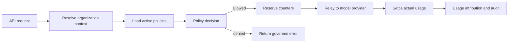

# Enterprise Organization And Quota Plan

本文档规划 Data Proxy 面向企业内部使用时的组织、部门、分组、额度、
权限和审计能力。目标不是替代现有用户钱包额度和运行分组，而是在其上增加
企业治理层，让管理员可以把 AI 使用权、预算和风险边界按组织真实结构下发。

配套文档：

- `docs/enterprise-org-quota-mvp-delivery-plan.md`：MVP 交付总入口、里程碑和完成定义。
- `docs/enterprise-org-quota-cel-policy-engine-plan.md`：CEL 条件层和策略引擎开发目标。
- `docs/enterprise-org-quota-task-plan.md`：阶段、Backlog、PR 切分和验收。
- `docs/enterprise-org-quota-implementation-blueprint.md`：工程落地蓝图。
- `docs/enterprise-org-quota-rollout-runbook.md`：发布、灰度、观测和回滚手册。

## 背景

企业内部落地 AI 网关时，管理需求通常会从“给用户充值额度”升级为：

- 按企业、部门、小组、项目、人员分配预算和调用次数。
- 按角色控制能否使用高级模型、外部模型、图片、语音、联网、MCP 工具等能力。
- 按部门或项目做成本归集、费用分摊和用量复盘。
- 在超额时提供拒绝、降级、审批、临时额度等不同动作。
- 对敏感部门、敏感模型和敏感工具调用保留审计链路。

当前系统已有 `User.Group`、用户额度、令牌额度、日志、渠道和模型路由能力。
企业治理层应复用这些底座，但不要把组织结构强塞进现有运行分组字段。

## 命名边界

为避免概念混淆，后续实现建议固定这些名字：

| 概念 | 含义 | 与现有能力关系 |
| --- | --- | --- |
| Enterprise | 企业或租户，是组织治理的顶层边界 | MVP 可只有一个企业，但数据模型保留 `enterprise_id` |
| Org Unit | 企业内部门、子部门、小组，支持树形结构 | 新增能力 |
| Policy Group | 跨部门策略分组，如“实习生”“高阶模型试点用户” | 新增能力，不等同于 `User.Group` |
| Runtime Group | 当前 `User.Group`，影响模型可用性、倍率、渠道路由 | 保留现状，可被策略映射或覆盖 |
| Project | 项目、成本中心、业务线或应用 | MVP 可暂缓，整体方案保留 |
| Quota Policy | 对人、部门、分组、项目等生效的额度和权限策略 | 新增能力 |
| Quota Counter | 策略周期内的实时消耗计数 | 新增能力，和用户钱包额度并行 |
| Usage Attribution | 每次调用归属到企业、部门、项目、策略和用户 | 扩展现有日志/账单事件 |

## 总体目标

1. 管理员可以表达组织结构：企业、部门树、跨部门分组、成员关系。
2. 管理员可以表达策略：谁能用什么、每天/月能用多少、超了怎么办。
3. 调用链路可以在请求前快速判断是否允许，在请求后准确归集用量。
4. 报表可以回答：哪个部门、项目、模型、用户消耗最多，是否超预算。
5. 架构可以逐步扩展到审批、SSO 同步、成本中心和多企业隔离。

## 总体方案

整体采用“组织上下文 + 策略解析 + 额度账本 + 用量归集”的架构。



### 组织模型

组织模型分三层：

- 企业：部署级或租户级边界，用于隔离成员、策略、审计和报表。
- 部门树：支持总公司、事业部、部门、小组等层级，用户通常有一个主部门。
- 策略分组：支持跨部门成员集合，用于表达“高阶模型白名单”“试点用户”等。

长期还应支持项目/成本中心。项目不是组织树的一部分，而是一次调用的费用归属。
一个用户可以在研发部，但把某次调用计入“新品发布项目”。

### 策略模型

策略应覆盖五类能力。

| 策略类型 | 示例 |
| --- | --- |
| 额度策略 | 每日请求数、每日 token、每月金额、图片生成次数、高阶模型次数 |
| 速率策略 | RPM、TPM、并发数、队列优先级 |
| 模型权限 | 允许模型、禁止模型、指定模型族、超额后降级模型 |
| 功能权限 | 文件上传、联网搜索、MCP 工具、图片、语音、视频、批量任务 |
| 合规策略 | 禁止外部模型、只允许指定渠道、敏感部门强制本地模型、保留审计 |

策略对象可以绑定到企业、部门、策略分组、用户、项目、API Key。策略字段建议
使用结构化列承载常用查询，用 JSON 承载模型范围、功能范围和扩展条件。

### 策略解析规则

一次请求会解析出上下文：

- 用户。
- 用户所属企业。
- 用户主部门及所有上级部门。
- 用户所在策略分组。
- 请求声明的项目或成本中心。
- 使用的 API Key、模型、能力类型。

解析规则建议：

1. 显式拒绝优先级最高。
2. 模型和功能权限取交集，只有所有硬约束都允许时才能继续。
3. 额度类策略不是互相覆盖，而是全部检查；任何一个硬上限超额都拒绝。
4. 用户级策略可以给更高额度，但不能突破企业级硬预算，除非有明确的
   `override_enterprise_limit` 权限。
5. 策略优先级只用于处理同一对象、同一指标的冲突配置，不用于跳过上级预算。
6. 软限制只告警或提示；硬限制会拒绝、降级或发起审批。

### 额度账本

企业治理层需要独立的周期计数器，不应直接复用用户钱包字段。

支持的指标：

- 请求次数。
- 输入 token、输出 token、总 token。
- 折算额度或金额。
- 按能力计数，如图片张数、语音分钟、视频秒数、MCP 调用次数。
- 并发数、RPM、TPM 等实时限流指标。

计数方式：

- 请求前预估并预占，避免并发击穿。
- 请求完成后用实际消耗结算差额。
- 请求失败时回滚或标记失败消耗，按策略决定是否计费。
- Redis 可用时用原子计数和 TTL；Redis 不可用时回退到数据库事务或行锁。
- 每次结算写入用量归集，便于报表和审计。

### 超额动作

超额不应只有“拒绝”。长期应支持：

- 拒绝请求，返回可读错误。
- 自动降级到低成本模型。
- 降低并发或排队优先级。
- 允许短时突发，但记录预算透支。
- 发起主管审批，审批通过后获得临时额度。
- 只允许继续使用基础模型，禁用高阶模型或高成本能力。

MVP 先支持拒绝和只读告警；降级和审批放到后续阶段。

### 报表和审计

报表最少需要支持：

- 按企业、部门、分组、用户、模型、渠道聚合消耗。
- 按日/月查看请求数、token、金额、失败率。
- 查看即将超额、已超额、异常突增的对象。
- 追踪某次调用命中了哪些策略、扣了哪些计数器。

审计记录应包含：

- 谁修改了组织结构、成员关系和策略。
- 策略变更前后值。
- 请求被拒绝、降级、审批通过的原因。
- 敏感能力调用的请求 ID、用户、部门、模型、工具和结果状态。

## 其他可扩展用法

除了每日用量和次数，企业内部还会自然需要这些能力：

- 项目预算：把费用归属到项目，而不是只归属到人。
- 成本中心：按财务科目或业务线做内部结算。
- 试点白名单：让少数人先试用新模型或新工具。
- 采购控制：昂贵模型按月设预算，普通模型按日设次数。
- 部门保护：财务、人事、法务只能走私有模型或指定渠道。
- 应用额度：不同 API Key 代表不同内部应用，各自有预算。
- 临时活动：某个项目在发布周临时提高额度，过期自动恢复。
- 借用/突发池：部门额度用尽后可从企业共享池借用一定比例。
- 异常检测：用户或部门消耗突然放大时告警或自动限流。
- 离职回收：用户禁用后自动释放策略分组、项目成员和 API Key 权限。
- SSO 同步：从 LDAP、企业微信、飞书、钉钉、Okta 同步部门和成员。
- 数据驻留：指定部门只能使用某些区域或本地部署渠道。
- 审批链：高阶模型、联网搜索、文件上传、超额申请走不同审批人。

## MVP 方案

MVP 的目标是用最小闭环证明“企业组织治理 + 每日/月额度控制”可用，并且
不重写现有计费系统。

### MVP 范围

必须做：

- 单企业组织模型，数据表保留 `enterprise_id`。
- 部门树管理：创建、编辑、停用、移动部门。
- 用户归属：用户绑定一个主部门，可加入多个策略分组。
- 策略分组：创建分组、管理成员。
- 额度策略：按企业、部门、策略分组、用户设置每日或每月上限。
- 强限制指标：请求次数、系统 quota。
- 归集指标：请求次数、系统 quota、输入 token、输出 token、总 token。
- 模型权限：允许全部模型或指定模型列表。
- 请求前检查和请求后结算。
- 基础报表：按部门、分组、用户查看周期内消耗。
- 审计日志：组织、成员、策略变更记录。

暂不做：

- 多企业后台和租户切换。
- 项目/成本中心必选归属。
- 审批流。
- 自动降级模型。
- SSO 自动同步。
- token 级硬限制。
- 普通管理员可编辑的任意表达式策略。
- 组织级发票或内部结算单。
- 多级管理员权限的完整 RBAC。

### MVP 用户故事

1. 系统管理员创建企业默认组织和部门树。
2. 系统管理员把用户移动到部门，并将部分用户加入“高阶模型试点”分组。
3. 系统管理员给研发部设置每月 500 美元预算，给实习生分组设置每日 50 次请求。
4. 系统管理员允许高阶模型试点分组使用指定高级模型，普通成员只能使用默认模型。
5. 用户请求模型时，系统先检查组织额度和模型权限。
6. 超额时系统拒绝请求，并返回“部门月度预算已用尽”这类可读原因。
7. 管理员在报表中看到部门、分组、用户的消耗排行。

### MVP 数据模型

建议新增表：

```text
enterprises
  id, name, slug, status, created_at, updated_at

enterprise_org_units
  id, enterprise_id, parent_id, name, path, depth, sort_order, status,
  created_at, updated_at

enterprise_org_memberships
  id, enterprise_id, user_id, org_unit_id, role, is_primary,
  created_at, updated_at

enterprise_policy_groups
  id, enterprise_id, name, description, status, created_at, updated_at

enterprise_policy_group_members
  id, enterprise_id, group_id, user_id, created_at

enterprise_quota_policies
  id, enterprise_id, target_type, target_id, name, status, priority,
  period, metric, limit_value, timezone, model_scope, model_scope_json,
  condition_mode, condition_json, condition_expr, condition_hash,
  action, starts_at, ends_at, created_at, updated_at

enterprise_quota_counters
  id, enterprise_id, policy_id, target_type, target_id, metric,
  period_start, period_end, used_value, reserved_value,
  created_at, updated_at

enterprise_usage_attributions
  id, request_id, user_id, enterprise_id, org_unit_id, policy_group_ids_json,
  policy_ids_json, model_name, channel_id, prompt_tokens, completion_tokens,
  total_tokens, quota, status, created_at

enterprise_audit_logs
  id, enterprise_id, actor_user_id, action, target_type, target_id,
  before_json, after_json, created_at
```

MVP 策略条件采用“结构化 UI 配置 + 后端生成 CEL”的方式：普通管理员只看到
固定字段表单，后端把 `condition_json` 生成可编译、可执行的 `condition_expr`。
CEL 只判断策略是否适用于本次请求，不参与 counter 预占、结算或数据库查询。

### MVP API 草案

```text
GET    /api/enterprise/current
PUT    /api/enterprise/current

GET    /api/enterprise/org-units
POST   /api/enterprise/org-units
PUT    /api/enterprise/org-units/:id
DELETE /api/enterprise/org-units/:id

GET    /api/enterprise/members
PUT    /api/enterprise/members/:user_id/org-unit

GET    /api/enterprise/policy-groups
POST   /api/enterprise/policy-groups
PUT    /api/enterprise/policy-groups/:id
DELETE /api/enterprise/policy-groups/:id
POST   /api/enterprise/policy-groups/:id/members
DELETE /api/enterprise/policy-groups/:id/members/:user_id

GET    /api/enterprise/quota-policies
POST   /api/enterprise/quota-policies
PUT    /api/enterprise/quota-policies/:id
DELETE /api/enterprise/quota-policies/:id

GET    /api/enterprise/usage/summary
GET    /api/enterprise/usage/breakdown
GET    /api/enterprise/audit-logs
```

### MVP UI 草案

建议在管理区新增“企业治理”模块，包含四个页面：

- 组织架构：左侧部门树，右侧部门成员和部门基础信息。
- 策略分组：分组列表、成员管理、关联策略数量。
- 额度策略：策略列表、创建/编辑抽屉、启用状态、周期、指标、目标对象。
- 用量报表：部门/分组/用户排行，周期筛选，超额状态筛选。

策略创建表单第一版只保留必要字段：

```text
名称
目标类型：企业 / 部门 / 策略分组 / 用户
目标对象
周期：每日 / 每月
指标：请求次数 / 系统 quota
上限
模型范围：全部 / 指定模型
超额动作：拒绝
生效时间
适用条件：能力类型 / 运行分组 / 模型前缀 / Playground / 渠道
状态：启用 / 停用
```

“适用条件”使用多选、开关和输入数组保存为 `condition_json`；普通 UI 不展示
CEL 编辑器。高级 CEL 模式可以作为 root-only 能力后置。

### MVP 调用链路

请求进入 relay 前：

1. 解析用户和 API Key。
2. 加载用户企业、主部门、部门祖先、策略分组。
3. 查询并缓存适用策略。
4. 检查模型权限。
5. 按预估值预占所有相关额度计数器。
6. 任一计数器超额则回滚预占并拒绝。

请求完成后：

1. 根据实际 token 和实际 quota 结算差额。
2. 写入 `enterprise_usage_attributions`。
3. 写入或扩展现有日志字段，保留 request ID 可追踪。
4. 请求失败时根据现有计费规则决定回滚还是记录失败消耗。

### MVP 策略命中示例

研发部用户使用高级模型时，系统可能命中：

- 企业月度总预算。
- 研发部月度预算。
- 高阶模型试点分组每日请求次数。
- 用户个人每日 token 上限。
- 高级模型白名单。

这些策略全部通过才允许请求。只要研发部月度预算用尽，即使用户个人额度仍有剩余，
请求也应拒绝。

### MVP 验收标准

- 管理员可以创建部门树，并把用户分配到部门。
- 管理员可以创建策略分组，并维护成员。
- 管理员可以给企业、部门、策略分组、用户配置每日/月额度策略。
- 用户请求命中策略后，超额会被稳定拒绝，并返回明确原因。
- 并发请求不会明显突破同一个周期上限。
- 请求完成后可在报表中按部门、分组、用户看到消耗。
- 组织、成员、策略变更都有审计记录。
- 不影响未启用企业治理的现有用户额度、令牌额度、渠道路由和日志。

## 分阶段路线

### Phase 0: 基础设计

- 确认命名边界和数据模型。
- 明确现有 `User.Group` 与新策略分组的关系。
- 确认 quota 口径：token、金额、系统 quota 之间的换算。
- 设计策略检查服务接口，先不接 UI。

### Phase 1: MVP

- 数据表和迁移。
- 组织、部门、策略分组 CRUD。
- 额度策略 CRUD。
- relay 前置检查和后置结算。
- 基础报表和审计。

### Phase 2: 项目和成本中心

- 支持项目维度归集。
- API Key 可绑定默认项目。
- 用户调用时可显式传项目 ID。
- 报表支持项目、部门、用户三维透视。

### Phase 3: 审批和临时额度

- 超额申请。
- 主管审批。
- 临时额度包。
- 到期自动失效。
- 审批链审计。

### Phase 4: SSO 和自动同步

- LDAP、企业微信、飞书、钉钉、Okta 同步。
- 部门和成员定时同步。
- 离职、转岗、部门移动自动更新权限。
- 同步冲突处理。

### Phase 5: 高级治理

- 模型降级策略。
- 借用/突发预算池。
- 异常检测和自动限流。
- 敏感数据策略。
- 更细的管理员 RBAC。
- 多企业隔离后台。

## 风险和注意事项

- 不要把组织分组复用到 `User.Group`，否则会和模型倍率、渠道路由耦合。
- 不要只在请求后扣费，否则并发下容易突破日额度。
- 不要只保存最终拒绝结果，策略命中链路也要可追踪。
- 不要在普通管理 UI 开放任意表达式策略；先用结构化条件保证可解释和可测试。
- 不要让部门额度“覆盖”企业额度；企业预算应始终是硬边界。
- 报表口径要和现有计费口径一致，否则管理员会看到两套数字。
- Redis 原子计数和数据库最终一致需要明确补偿机制。

## 推荐下一步

1. 先实现单企业、部门树、策略分组、额度策略四张核心管理面。
2. 在 relay 计费前后加企业策略服务，但默认关闭。
3. 选一类最稳定指标作为第一版：请求次数和系统 quota。
4. 等策略命中和报表闭环稳定后，再加入 token 明细、项目、审批和 SSO。
