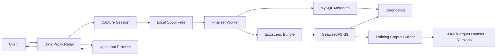

# Request Capture, Diagnostics, and Training Data Architecture

Date: 2026-06-23

This project is based on `new-api`. The capture and diagnostics design must
keep upstream AGPL attribution intact, avoid copying incompatible code, and
make data retention, export, and deletion explicit.

## Goals

- Save all configured relay requests and responses for later diagnostics and
  model-improvement workflows.
- Keep raw request/response data out of normal usage logs.
- Store raw data in encrypted bundles backed by a lightweight object store.
- Make streaming capture fast enough that it does not slow token streaming.
- Build diagnostics from existing logs first, then enrich diagnostics with raw
  bundles when available.
- Build training datasets from curated, redacted, versioned samples instead of
  training directly on raw production bundles.

## Non-Goals

- Do not build a custom object-storage engine inside Data Proxy.
- Do not write every stream chunk to MySQL or Redis.
- Do not expose SeaweedFS or captured raw data to the public internet.
- Do not use raw production bundles directly as final training data.

## Current State

Current normal LLM relay logs store summaries and metadata such as request id,
model, channel, token counts, quota, stream status, and request conversion
metadata. They do not persist full raw client requests or full raw upstream /
downstream responses.

The existing reusable request body storage is request-lifetime cache and is
cleaned after the request. Some special subsystems, such as enterprise queue
replay or bridge audit, can store request bodies for their own workflows, but
that is not a general full-fidelity capture system for normal relay traffic.

## Implementation Status

The current implementation has landed the database metadata models,
SeaweedFS/S3-compatible object store foundation, production Docker volume
mapping, environment variable examples, a local spool session writer, and a
tar + zstd + AES-GCM finalizer with artifact persistence. A minimal
environment-based capture policy matcher and relay request hook are also
implemented. Raw relay capture is still disabled by default. The current relay
hook captures metadata, client request bodies, raw upstream response bodies,
and downstream response bytes. Streaming response bodies use buffered async
spool writes and fail open if capture cannot keep up. When capture is truncated
because of backpressure or `CAPTURE_MAX_ARTIFACT_BYTES`, the relay stores
`capture_truncated` metadata and the diagnostic report emits a
`capture_truncated` warning. A single-node finalizer scanner runs on the master
process, applies DB-backed retry/backoff, recovers
old `active`/`finalize`/`failed` spool directories on boot, and supports
admin-only request diagnostic bundle downloads from the usage log detail UI.
Retention cleanup is implemented for the current single-node deployment:
expired capture records are marked `expired`, available raw bundle artifacts
are deleted from SeaweedFS/S3-compatible storage and then marked `deleted`, and
old local `failed/` plus already uploaded/expired `finalize/` spool directories
are removed by a master-process background worker. The cleanup worker is
single-process guarded and can also be run manually through
`POST /api/log/request-capture/cleanup?dry_run=true`. A service-layer training
corpus MVP is now implemented: it reads available encrypted raw bundles,
decodes them in memory with a size cap, applies basic JSON secret-key
redaction, extracts Chat/Responses JSON and SSE output text, writes a
versioned `jsonl.zst` shard to SeaweedFS/S3-compatible storage, and records
dataset/sample lineage in MySQL. Admin review and approval workflows are still
pending.

Concrete model definitions:

```text
model/request_capture.go
```

Concrete storage adapter:

```text
service/request_capture_object_store.go
```

Concrete spool writer:

```text
service/request_capture_spool.go
```

Concrete single-session finalizer:

```text
service/request_capture_finalizer.go
```

Concrete policy matcher:

```text
service/request_capture_policy.go
```

Concrete relay hook:

```text
service/request_capture_relay.go
controller/relay.go
```

Phased development order:

```text
docs/request-capture-diagnostics-implementation-plan.md
```

## Architecture

Use SeaweedFS as the lightweight local object store, with Data Proxy writing
through the S3 API. Data Proxy remains responsible for capture policy,
temporary spool files, encryption, bundle finalization, metadata indexing,
diagnostics, and training export.



## Storage Layers

### MySQL

Use MySQL for metadata and indexes only:

- request id lookup
- model/channel/user/token filters
- capture status
- storage key
- byte sizes and hashes
- expiration status
- diagnostics summary
- training sample lineage

MySQL must not be the long-term storage for raw stream bodies.

### Redis

For the current single-node Data Proxy deployment, request capture finalization
and cleanup use in-process master-node periodic workers with DB-backed status
and retry/backoff. Redis Stream or a small queue is reserved for a future
multi-node worker model:

- finalize captured spool
- upload bundle
- redact bundle
- build training samples
- cleanup expired bundles

Redis should not store raw request or response bodies.

### Local Spool

Use local filesystem spool for hot streaming writes:

```text
/data/dataproxy-capture/spool/active/{request_id}/
/data/dataproxy-capture/spool/finalize/{request_id}/
/data/dataproxy-capture/spool/failed/{request_id}/
```

The relay path writes `.part` files to spool. The finalizer worker later
compresses, encrypts, uploads, and removes the spool files.

### SeaweedFS

Use SeaweedFS as the object store behind the S3 API.

Bucket:

```text
data-proxy-captures
```

Raw bundles:

```text
raw/2026/06/23/13/ab/cd/{request_id}.bundle.tar.zst.enc
```

Training datasets:

```text
training/dataset=v1/date=2026-06-23/part-0001.jsonl.zst
training/dataset=v1/date=2026-06-23/part-0002.jsonl.zst
```

## Docker Volumes

On the production server, keep capture storage under:

```text
/root/workspace/dataproxy/storage
```

Recommended host layout:

```text
/root/workspace/dataproxy/storage/
  seaweedfs/
    master/
    volume/
    filer/
  capture/
    spool/
    tmp/
  exports/
```

Docker Compose must persist SeaweedFS and Data Proxy spool directories:

```yaml
services:
  seaweedfs:
    image: chrislusf/seaweedfs:latest
    command: >
      server
      -master
      -volume
      -filer
      -s3
      -dir=/data
    volumes:
      - /root/workspace/dataproxy/storage/seaweedfs:/data
    networks:
      - data-proxy-internal
    restart: unless-stopped

  data-proxy:
    volumes:
      - /root/workspace/dataproxy/storage/capture/spool:/data/dataproxy-capture/spool
      - /root/workspace/dataproxy/storage/capture/tmp:/data/dataproxy-capture/tmp
    environment:
      CAPTURE_ENABLED: "true"
      CAPTURE_OBJECT_BACKEND: "s3"
      CAPTURE_S3_ENDPOINT: "http://seaweedfs:8333"
      CAPTURE_S3_BUCKET: "data-proxy-captures"
      CAPTURE_SPOOL_DIR: "/data/dataproxy-capture/spool"
      CAPTURE_FINALIZER_ENABLED: "true"
      CAPTURE_FINALIZER_INTERVAL_SECONDS: "60"
      CAPTURE_FINALIZER_RETRY_BASE_SECONDS: "60"
      CAPTURE_FINALIZER_RETRY_MAX_SECONDS: "3600"
      CAPTURE_SPOOL_WARN_BYTES: "268435456"
```

The tracked Compose overlay is:

```text
docker-compose.capture-storage.yml
```

Production command:

```bash
docker compose -f docker-compose.prod.yml -f docker-compose.capture-storage.yml up -d
```

SeaweedFS should be reachable only on the Docker internal network. Do not
publish the S3 gateway to the public internet.

If the finalizer worker becomes a separate container, it must mount the same
`capture/spool` volume as the relay container.

## Capture Bundle Format

Each request becomes one encrypted bundle object:

```text
{request_id}.bundle.tar.zst.enc
```

Bundle contents:

```text
manifest.json
client_request.json
upstream_request.json
upstream_response.sse
downstream_response.sse
usage.json
trace.json
redaction.json
```

For non-stream requests, response files can use `.json` instead of `.sse`.

`manifest.json` should include:

- request id
- upstream request id
- user id
- token id
- channel id
- model
- request path
- protocol chain
- capture level
- artifact list
- byte sizes
- hashes
- truncation flags
- encryption metadata id

## Capture Levels

Supported capture levels:

| Level | Meaning |
| --- | --- |
| `off` | No raw capture. Logs and trace metadata only. |
| `metadata` | Capture structure, counters, and trace metadata only. |
| `sanitized_bundle` | Capture redacted request and response bundle. |
| `full_bundle` | Capture full raw request and response bundle. Admin-only and short TTL. |

For model-improvement data, use `sanitized_bundle` or post-processed training
samples. `full_bundle` is for short-lived debugging only.

## Capture Policy

Capture should be configurable by:

- time window
- user id
- token id
- channel id
- model name pattern
- request path
- protocol conversion
- app / connected app id
- severity flags
- sample rate

The environment policy currently exposes time-window selectors through
`CAPTURE_START_TIMESTAMP` and `CAPTURE_END_TIMESTAMP` using Unix seconds. It
also exposes `CAPTURE_SEVERITIES` for explicit diagnostic or abnormal-flow
labels such as `warning,error`; normal relay traffic that has no severity label
will not match that selector.

Because the product goal is to save all configured traffic for model
improvement, the default production policy can be broad, but it still must
support opt-out scopes and administrative controls.

## Streaming Performance Design

The relay goroutine must never upload to SeaweedFS per token. It only writes to
a local capture session.

Runtime flow:

```text
Upstream stream chunk
  -> conversion / client write
  -> capture session enqueue
  -> capture writer batch flush to local .part file
```

Recommended defaults:

| Setting | Suggested Value |
| --- | --- |
| capture channel buffer | 256-1024 chunks |
| write buffer | 64 KiB or 256 KiB |
| flush interval | 200 ms to 1 s |
| max artifact bytes | `CAPTURE_MAX_ARTIFACT_BYTES`; `0` means unlimited |
| backpressure behavior | mark truncated and continue user response |

If capture cannot keep up, mark:

```text
capture_truncated=true
capture_truncated_artifacts=["downstream_response.sse"]
capture_truncation_reasons={"downstream_response.sse":"backpressure"}
```

The minimal implementation already enforces a per-artifact byte limit in the
spool writer. Oversized artifacts keep the first configured bytes, set
`truncated=true` in `manifest.json`, update capture record metadata, and never
block the normal model response. Diagnostic reports surface this as a warning so
operators know the raw bundle is useful but incomplete.

The user request must continue whenever possible.

## Finalizer Worker

The finalizer consumes spool directories:

1. Validate required files and manifest.
2. Close any partial streams.
3. Build tar archive.
4. Compress with zstd.
5. Encrypt with AES-256-GCM.
6. Compute SHA-256.
7. Upload to SeaweedFS S3.
8. Update MySQL metadata.
9. Remove spool files.

If upload fails, keep the spool directory in `finalize/`, update
`request_capture_records.finalize_attempts`, `next_finalize_at`, and
`last_error`, and retry with exponential backoff. Successful uploads can remove
the spool directory when `CAPTURE_FINALIZER_REMOVE_ON_SUCCESS=true`.

On process restart, recovery scans:

```text
spool/active
spool/finalize
spool/failed
```

and marks old incomplete captures as aborted or retries finalization.

For the current single-node deployment, this recovery runs in the same master
process as Data Proxy. Multi-node coordination is intentionally deferred.

## Online Request Diagnostics

Admin-only endpoints:

```text
GET  /api/log/request-diagnostic-candidates
GET  /api/log/request/:request_id/diagnostic
POST /api/log/request/:request_id/diagnostic
GET  /api/log/request/:request_id/diagnostic/bundle
```

The diagnostic bundle endpoint returns a zip with:

- `diagnostic/report.json`
- `diagnostic/trace.json`
- `diagnostic/capture.json` when capture metadata exists
- `diagnostic/findings.json`
- `capture/raw/*` decoded from the encrypted raw bundle when available

If the raw bundle is missing, cannot be decoded, or exceeds
`DIAGNOSTIC_BUNDLE_MAX_RAW_TAR_BYTES`, the zip still includes the diagnostic
report plus a short marker under `capture/`. The default raw tar expansion limit
is 256 MiB; `0` disables the diagnostic download limit. This limit only protects
the download process and does not truncate the object-storage capture artifact.

## Encryption

Use application-level encryption before writing to SeaweedFS:

```text
tar.zst -> AES-256-GCM -> tar.zst.enc
```

Environment:

```text
CAPTURE_BUNDLE_ENCRYPTION=true
CAPTURE_BUNDLE_MASTER_KEY=...
```

Each bundle should use a unique data key. Store only the encrypted data key and
metadata in MySQL. Without a configured master key, `full_bundle` must be
disabled.

## Metadata Schema Draft

### `request_capture_records`

```text
id
request_id
upstream_request_id
user_id
token_id
channel_id
model_name
request_path
client_protocol
upstream_protocol
is_stream
capture_level
capture_status
storage_backend
storage_bucket
storage_key
bundle_size_bytes
raw_size_bytes
compressed_size_bytes
bundle_sha256
encrypted
truncated
truncate_reason
pii_level
created_at
finished_at
expires_at
created_by
```

### `request_capture_artifacts`

```text
id
capture_record_id
request_id
artifact_type
content_type
original_bytes
stored_bytes
sha256
truncated
created_at
```

### `request_diagnostic_reports`

```text
id
request_id
capture_record_id
severity
flags_json
summary_json
recommendations_json
created_by
created_at
expires_at
```

### `training_dataset_versions`

```text
id
name
version
source_filter_json
redaction_version
sample_count
storage_key
created_by
created_at
```

### `training_samples`

```text
id
dataset_version_id
request_id
capture_record_id
sample_type
model_name
quality_score
pii_status
input_hash
output_hash
storage_key
created_at
```

## APIs

### Capture Admin

```text
GET  /api/capture/policies
POST /api/capture/policies
POST /api/capture/policies/:id/enable
POST /api/capture/policies/:id/disable
GET  /api/capture/records
GET  /api/capture/records/:request_id
GET  /api/capture/records/:request_id/download
DELETE /api/capture/records/:request_id
```

### Diagnostics

```text
GET  /api/log/diagnostics/candidates
POST /api/log/request/:request_id/diagnose
GET  /api/log/request/:request_id/diagnostic-report
GET  /api/log/request/:request_id/diagnostic-report/download
```

### Training Data

```text
GET  /api/training/datasets
POST /api/training/datasets/build
GET  /api/training/datasets/:id/export
GET  /api/training/samples
POST /api/training/samples/:id/approve
POST /api/training/samples/:id/reject
```

Implemented admin endpoints:

- `GET /api/training/datasets`: list dataset versions with optional `name` and
  `status` filters.
- `POST /api/training/datasets/build`: build a single-node `jsonl.zst` shard
  from available raw capture bundles.
- `GET /api/training/datasets/:id/export`: download an approved-only
  `jsonl.zst` export. The endpoint reads the generated dataset shard, filters
  lines by approved `training_samples.source_hash`, and returns a recompressed
  shard so pending or rejected samples are not exported for training by
  default.
- `GET /api/training/samples`: list sample lineage with filters such as
  `dataset_version_id`, `request_id`, `model_name`, `min_quality_score`, and
  `review_status`.
- `GET /api/training/samples/:id/preview`: load the generated dataset shard and
  return the matching JSONL sample by `source_hash` for admin review.
- `POST /api/training/samples/:id/approve`: mark a sample approved with an
  optional review comment.
- `POST /api/training/samples/:id/reject`: mark a sample rejected with an
  optional review comment.

Pending endpoints:

- richer policy-aware export gates

## Diagnostics Module

Diagnostics should work even when no raw capture bundle exists. It uses usage
logs and request conversion metadata first, then enriches results with capture
records when available.

Candidate flags:

- provider error
- stream failed
- stream missing terminal event
- HTTP 200 with no visible output
- reasoning-only stream
- hosted tool filtered
- tool call without final answer
- tool call without tool output
- previous response history restore miss
- Chat SSE fallback on non-stream route
- response failed / incomplete
- conversion parser error

Severity:

| Severity | Meaning |
| --- | --- |
| P0 | Hard failure or upstream error. |
| P1 | User-visible blank, stream break, tool loop, or failed conversion. |
| P2 | Risky fallback, hosted tool filtering, incomplete output, or degraded compatibility. |

## Training Corpus Builder

Raw bundles are not final training data. A builder job should:

1. Load encrypted raw bundle.
2. Decrypt in worker memory.
3. Redact secrets and PII.
4. Normalize protocol variants into one training schema.
5. Split into sample types:
   - chat SFT sample
   - tool-call sample
   - failed / negative sample
   - reasoning compatibility sample
6. Deduplicate by input and output hash.
7. Score quality.
8. Write JSONL.zst or Parquet shards back to SeaweedFS.
9. Record dataset version and sample lineage.

Example output:

```text
training/dataset=domestic-responses-chat/date=2026-06-23/part-0001.jsonl.zst
```

## Implementation Plan

### Phase 1: SeaweedFS and Capture Metadata

- Add SeaweedFS service to production Docker Compose.
- Add required volume mappings.
- Add capture environment settings.
- Add MySQL tables for capture records and artifacts.
- Add storage client using S3 API pointed at SeaweedFS.

Acceptance:

- Data Proxy can upload and download a test object from SeaweedFS.
- Data survives container restart.
- SeaweedFS is not exposed publicly.

### Phase 2: Local Spool and Finalizer

- Add capture spool writer.
- Add finalizer worker.
- Build `bundle.tar.zst.enc` from spool files.
- Upload bundle to SeaweedFS.
- Record metadata and cleanup spool files.
- Add crash recovery for stale spool files.

Acceptance:

- Non-stream and stream test captures produce downloadable bundles.
- Capture failure does not fail relay requests.
- Restart during capture leaves recoverable or clearly failed records.

### Phase 3: Relay Capture Integration

- Capture client original request.
- Capture converted upstream request.
- Capture upstream response JSON/SSE.
- Capture downstream response JSON/SSE.
- Add capture-level policy checks.
- Add stream counters:
  - output text chunks
  - reasoning chunks
  - tool call chunks
  - terminal event

Acceptance:

- `/v1/chat/completions` and `/v1/responses` can both be captured.
- Stream responses remain real-time.
- Capture metadata is searchable by request id.

### Phase 4: Diagnostics UI and Reports

- Add Diagnostics page.
- Add candidate request list by time range and provider.
- Add manual diagnose by request id.
- Link diagnostics to capture records.
- Add downloadable diagnostic report.

Acceptance:

- Operators can find suspicious domestic-model requests without knowing the request id first.
- Request trace can open related capture record.
- Report works with and without raw bundle.

### Phase 5: Training Dataset Pipeline

- Add training sample builder.
- Add redaction pipeline.
- Add dataset version records.
- Export JSONL.zst.
- Add UI for sample review and approve/reject.

Acceptance:

- A selected time range can produce a versioned dataset export.
- Each sample keeps source request lineage.
- Rejected or deleted source requests can be excluded from future exports.

## Operational Requirements

- Storage directory should be on a data disk, not the root filesystem.
- SeaweedFS S3 endpoint must stay internal.
- Capture should fail open for relay traffic.
- Bundle download must require admin permission and audit logging.
- Cleanup jobs must enforce TTL.
- Storage usage alerts should trigger before disk is full.
- `full_bundle` should have shorter TTL than sanitized bundles.

## Rollout

1. Deploy SeaweedFS with an empty bucket and verify persistence.
2. Enable capture metadata only.
3. Enable sanitized capture for one test token and one channel.
4. Run stream and non-stream smoke tests.
5. Enable capture for domestic Responses -> Chat channels.
6. Monitor disk, Redis queue length, finalizer failures, and stream latency.
7. Expand policy only after storage and cleanup evidence is stable.

## Open Questions

- Default retention for raw full bundles.
- Whether users can opt out per token or per connected app.
- Whether training samples need manual approval before export.
- Whether large file uploads should be excluded from raw capture by default.
- Whether production should use one SeaweedFS service or a separate data disk
  mounted directly into the service container.
